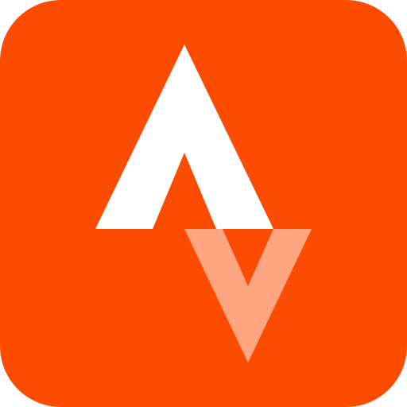

###  Hi there, I'm Pablo Quesada

I work as ~~Software Engineer~~ based in Berlin, Germany.

Since 2006 I've been doing software engineering. I've had the chance to work in many different industries (Energy Sector, Public Sector, Banking, Automobile, IT Infrastructure, Mobile App Development, etc) and develop my skills in these areas: Cloud Migrations, DevOps Culture, Agile Transformation, Data Engineering and Security.
  
### What I'm focusing on 👨🏽‍💻

Currently working as an Director of Engineering at SoundCloud. 
And on the side, mainly in the swimming pool🏊, cycling🚴🏼‍♂️ and climbing🧗🏼‍♂️.
  

### Some Technologies & Tools 💻 🔧

  

### Find me elsewhere 🌎

